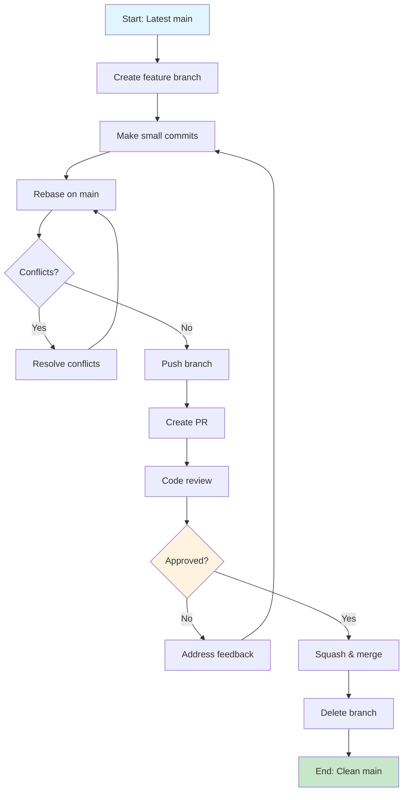

# GitHub Copilot Instructions

**Audience:** GitHub Copilot only. This file provides Copilot-specific instructions and configuration for this repository.

**Repository Context:**
This repository is a GitHub Template created by Capgemini's AI & Software Engineering Experts. It contains practical, portable, and useful examples of Copilot configuration for real-world projects.

**Copilot Guidance:**
- Follow the configuration and best practices outlined here when assisting in this repository.
- Reference `README.md` for general orientation and project goals.
- Reference `AGENTS.md` for broader AI agent instructions and context.


## Project Methodologies

### Branching Strategy & Development Workflow

<CRITICAL_REQUIREMENT type="MANDATORY">
AI assistants MUST follow trunk-based development with lightweight, short-lived feature branches. All changes MUST go through pull request review process.
</CRITICAL_REQUIREMENT>

**Core Principles:**
- **Trunk-based Development**: Work directly from `main` branch with short-lived feature branches (max 2-3 days)
- **Small, Frequent Commits**: Make numerous small commits rather than large, infrequent ones
- **Continuous Integration**: Every branch should be integration-ready and tested
- **Pull Request Mandatory**: ALL changes, no matter how small, MUST go through PR process

**Workflow Requirements:**
1. **Branch Creation**: Create feature branches from latest `main`
2. **Development**: Make small, focused commits with clear messages
3. **Integration**: Regularly rebase/merge from `main` to stay current
4. **Review**: Submit PR when feature/fix is complete
5. **Approval**: Obtain at least one approval before merging
6. **Cleanup**: Delete feature branch after successful merge

<WORKFLOW_ENFORCEMENT>
- Branch lifetime: Maximum 3 days from creation to merge
- Commit frequency: Minimum 1 commit per day of active work
- PR size: Target ≤ 400 lines of code changes per PR
- Review requirement: At least 1 human reviewer approval required
</WORKFLOW_ENFORCEMENT>

### Branch and Pull Request Naming Conventions

<NAMING_REQUIREMENTS type="MANDATORY">
AI assistants MUST use these exact naming patterns for branches and pull requests.
</NAMING_REQUIREMENTS>

**Branch Naming Pattern:**
```
<type>/<brief-description>
```

**Required Types:**
- `feature/` - New features or enhancements
- `fix/` - Bug fixes and hotfixes  
- `docs/` - Documentation updates
- `refactor/` - Code refactoring without functional changes
- `test/` - Test additions or modifications
- `chore/` - Maintenance tasks (dependencies, build scripts)

**Examples:**
- ✅ `feature/add-user-authentication`
- ✅ `fix/resolve-login-timeout`  
- ✅ `docs/update-api-documentation`
- ✅ `refactor/optimize-database-queries`
- ❌ `my-branch` (no type prefix)
- ❌ `feature/very-long-description-that-is-hard-to-read` (too verbose)

**Pull Request Naming:**
- PR titles MUST match branch name but use human-readable format
- Use imperative mood (same as commit messages)
- Examples:
  - Branch: `feature/add-user-authentication` → PR: "Add user authentication"
  - Branch: `fix/resolve-login-timeout` → PR: "Fix login timeout issue"

### Commit Message Conventions

<COMMIT_REQUIREMENTS type="MANDATORY">
AI assistants MUST follow these commit message conventions for all commits.
</COMMIT_REQUIREMENTS>

**Format Requirements:**
```
<type>: <subject>

[optional body]

[optional footer]
```

**Subject Line Rules:**
- Use **imperative mood** ("Add feature" not "Added feature" or "Adds feature")
- Start with capital letter
- No period at the end
- Maximum 50 characters
- Be specific and descriptive

**Type Categories:**
- `feat:` - New features
- `fix:` - Bug fixes
- `docs:` - Documentation changes
- `style:` - Code style changes (formatting, semicolons, etc.)
- `refactor:` - Code refactoring without functionality changes
- `test:` - Adding or updating tests
- `chore:` - Maintenance tasks, dependency updates

**Examples:**
- ✅ `feat: Add user authentication with OAuth2`
- ✅ `fix: Resolve login timeout in production environment`
- ✅ `docs: Update API documentation for user endpoints`
- ✅ `refactor: Extract validation logic into utility functions`
- ❌ `Added new feature` (not imperative)
- ❌ `fix bug` (too vague)
- ❌ `Update stuff` (not descriptive)

**Body and Footer Guidelines:**
- Body: Explain **what** and **why**, not **how**
- Footer: Reference issues, breaking changes
- Example:
  ```
  feat: Add user authentication with OAuth2
  
  Implement OAuth2 authentication to replace legacy session-based auth.
  This improves security and enables SSO integration.
  
  Closes #123
  ```

### Branch and Commit Process Workflow

<PROCESS_REQUIREMENTS type="MANDATORY">
AI assistants MUST follow this exact workflow for all code changes.
</PROCESS_REQUIREMENTS>

**Pre-Merge Requirements:**
1. **Rebase Strategy**: Always rebase feature branch on latest `main` before creating PR
2. **Commit Organization**: Squash related commits into logical units
3. **Testing**: Ensure all tests pass before requesting review
4. **Documentation**: Update relevant documentation as part of the same PR

**Merge Process:**
- **Squash and Merge**: Use squash merge for feature branches to maintain clean history
- **Linear History**: Maintain linear commit history on `main` branch
- **Branch Cleanup**: Delete feature branch immediately after successful merge
- **Rollback Ready**: Each merge to `main` should be easily revertible




## Coding Standards

<CODING_REQUIREMENTS type="MANDATORY">
AI assistants MUST follow these coding standards and reference project-specific guidelines when available.
</CODING_REQUIREMENTS>

**General Principles:**
- **Consistency**: Follow established patterns within the codebase
- **Readability**: Write code that is self-documenting and easy to understand
- **Maintainability**: Structure code for long-term maintenance and evolution
- **Security**: Apply secure coding practices appropriate for the technology stack
- **Performance**: Consider performance implications but prioritize readability unless performance is critical

**Project-Specific Standards:**
- **Backend Development**: Follow guidelines in `.github/instructions/backend.instructions.md`
- **Frontend Development**: Follow guidelines in `.github/instructions/frontend.instructions.md`
- **Documentation**: Follow guidelines in `.github/instructions/docs.instructions.md`
- **BDD Testing**: Follow guidelines in `.github/instructions/bdd-tests.instructions.md`

**Code Review Guidelines:**
- Reference: `docs/engineering/code-review-guidelines.md` (when available)
- All code MUST pass review before merging
- Focus on correctness, security, maintainability, and adherence to standards

**Pull Request Guidelines:**
- Reference: `docs/engineering/pull-request-guidelines.md` (when available)  
- Include clear description of changes and rationale
- Ensure PR size remains manageable (target ≤ 400 lines)
- Include relevant tests and documentation updates

**Language-Specific Standards:**
- **Java/Spring Boot**: Follow Spring Boot conventions and best practices
- **Python/Django**: Follow PEP 8 and Django conventions
- **C#/.NET**: Follow Microsoft C# coding conventions
- **JavaScript/TypeScript**: Follow established project linting rules
- **Documentation**: Use clear, concise language with proper Markdown formatting

**Quality Assurance:**
- All code MUST include appropriate unit tests
- Integration tests for complex workflows
- Documentation updates for public APIs or significant changes
- Security considerations documented and reviewed

---

## Repository Overview (This section may be removed if this is used as a template)

**.github Directory Structure & Purpose:**

The `.github` directory contains several subdirectories and files that organize configuration, prompts, and instructions for Copilot and other AI agents:

- `chatmodes/`: Contains chat mode configuration files (e.g., `custom-mode.chatmode.md`) that define custom conversational behaviors for Copilot and other agents.

- `instructions/`: Holds instruction files for backend, frontend, and documentation. These guide Copilot and other agents on best practices and project-specific rules. You must apply these instructions to relevant files in the repository.
  - `backend.instructions.md`
  - `docs.instructions.md`
  - `frontend.instructions.md`
  - `bdd-tests.instructions.md`

- `prompts/`: Includes prompt templates (e.g., `write-adr.prompt.md`, `write-docs.prompt.md`, `write-prd.prompt.md`) used to generate architectural decision records, documentation, and product requirements. These help standardize and accelerate content creation.

- `workflows/`: Intended for GitHub Actions workflow files, which automate CI/CD and other repository tasks. (Currently empty, but will be expanded.)

Refer to the main README.md for a full overview of repository goals and usage.