# Capgemini Github Copilot Template

Welcome! This repository is a GitHub Template created by Capgemini. It provides practical, portable, and useful examples of GitHub Copilot configuration for real-world projects.

## Who this is for

- Developers and teams adopting AI-assisted development
- Project and technical leads seeking guidance on best practices
- AI agents (including GitHub Copilot) needing repository context

## What this repository provides

This repository is intended to help teams adopt Copilot best practices, understand configuration options, and accelerate AI-powered development. It contains:

- Working Copilot configurations with examples:
  - Example [Chat modes](.github/chatmodes/README.md)
  - Example [Instructions](.github/instructions/README.md)
  - Example [Prompts](.github/prompts/README.md)
- A GitHub Copilot [configuration overview](.github/README.github.md)
- Clear documentation to understand, configure, and extend Copilot
- Examples of prompting techniques for each custom configuration
- A ready-to-use template to bootstrap new projects (“Use this template” on GitHub)
- Comprehensive documentation and explanatory README.md files throughout the project.

## How to get started

1. Create a new repository using “Use this template” (or fork/clone).
2. Review and adapt the example [chat modes](.github/chatmodes/README.md), [instructions](.github/instructions/README.md), and [prompts](.github/prompts/README.md).
3. Read the project docs in [docs/README.md](docs/README.md).

<!-- Replace this paragraph with hints on finding information elsewhere in the repository -->

## Best Practices

Reuse and reference instructions files in your prompt files and chat modes to keep them clean and focused, and to avoid duplicating instructions.

- Keep instructions modular and single-purpose: one file = one responsibility (e.g., safety rules, tone, examples).
- Use clear file names and a one-line summary at the top so contributors can find intent quickly.
- Provide one short example and one minimal counterexample for each rule so users and agents see expected output.
- Prefer imperative, action-oriented phrasing (“Do X”, “Avoid Y”) and concrete defaults (e.g., “Prefer 80-char lines”, “Use present tense”).
- Surface usage patterns: when to reuse this file vs. override it; link to canonical files rather than duplicating content.
- Add machine-friendly snippets or templates (prompts, code blocks, placeholders) that can be copy-pasted into prompts or chat modes.
- Keep guidance short (1–3 sentences per rule) and add a “Why this matters” one-liner for context when necessary.
- Version and change-log key updates so consumers know when behavior changed.
- Include a brief test plan or example queries that validate the instruction works as intended.
- Avoid embedding secrets or environment-specific data; reference where secure configs live (e.g., repo secrets, vault).
- When in doubt, be explicit: busy users prefer exact commands/phrases to adapt rather than broad theory.

### 1. Custom Chat Modes

The repository includes specialized chat modes located in `.github/chatmodes/`:

- **Developer Mode**: Focuses on test-driven development with quality gates and design-first methodology
- **Planner Mode**: Provides structured planning with task breakdown and dependency management
- **Documentation Mode**: Standardizes documentation creation following repository templates
- **Code Reviewer Mode**: Implements systematic code review with best practices enforcement
- **Tester Mode**: Emphasizes BDD-focused testing approach with comprehensive test coverage

### 2. Reusable Prompt Templates

Located in `.github/prompts/`, these templates provide standardized approaches for:

- **`write-adr.prompt.md`**: Creates Architectural Decision Records with structured templates
- **`write-prd.prompt.md`**: Generates Product Requirements Documents with measurable objectives
- **`write-docs.prompt.md`**: Produces consistent documentation following repository standards
- **`write-ears-spec.prompt.md`**: Creates requirements using Easy Approach to Requirements Syntax
- **`copilot-setup-check.prompt.md`**: Evaluates and optimizes Copilot configuration

### 3. Comprehensive Instruction System

The `.github/instructions/` directory contains detailed guidelines for:

- **`backend.instructions.md`**: Server-side development best practices
- **`frontend.instructions.md`**: Client-side development guidelines
- **`docs.instructions.md`**: Documentation creation and maintenance standards
- **`bdd-tests.instructions.md`**: Behavior-driven development testing methodology

### 4. Repository Structure & Templates

The `docs/` directory provides organized templates for:

- **ADRs** (`docs/ADRs/`): Architecture decision documentation with context and consequences
- **PRDs** (`docs/PRDs/`): Product requirements with priorities and acceptance criteria
- **Design Documents** (`docs/design/`): Technical design specifications
- **Engineering Guidelines** (`docs/engineering/`): Development process documentation

### 5. Project Planning Framework

The `plans/` directory includes:

- **Plan Templates**: Structured project planning with stakeholders and timelines
- **Roadmap Management**: Strategic planning and milestone tracking
- **TODO Management**: Task tracking and completion monitoring

### 6. Workflow Integration

#### Branching Strategy

The repository enforces trunk-based development with:

- Short-lived feature branches (maximum 3 days)
- Mandatory pull request reviews
- Squash and merge for clean history
- Automatic branch cleanup

#### Commit Conventions

All commits must follow conventional commit format:

```text
<type>: <subject>

[optional body]

[optional footer]
```

Types include: `feat`, `fix`, `docs`, `style`, `refactor`, `test`, `chore`

#### Version Control

- Tag major releases with semantic versioning
- Maintain changelog for significant updates
- Archive deprecated features in `plans/archive/`

### 7. Copying Copilot Customisations

The custom chatmodes, instructions and prompts can be copied into the same directory structure of another repository. Each file has comments that explain the approach, structure and content of each file.

Reuse and reference instructions files in your prompt files and chat modes to keep them clean and focused, and to avoid duplicating instructions.

### Adding New Features

When adding new chat modes, prompts, or instructions:

1. Follow existing naming conventions
2. Include comprehensive documentation
3. Add examples and usage guidelines
4. Update this master documentation
5. Test with multiple scenarios before finalizing

## Where to find more information

- See `.github/copilot-instructions.md` for Copilot-specific rules and configuration
- See `CONTRIBUTING.md` for guidelines on contributing to this repository

### Copilot Customisation

You can find more about how to [customise and extend GitHub Copilot](https://docs.github.com/en/copilot/how-tos/configure-custom-instructions/add-repository-instructions?tool=vscode), or how to customise Copilot behaviour in [Visual Studio Code](https://code.visualstudio.com/docs/copilot/customization/overview), and other IDEs such as [Jetbrains](https://docs.github.com/en/copilot/how-tos/configure-custom-instructions/add-repository-instructions?tool=jetbrains), [Eclipse](https://docs.github.com/en/copilot/how-tos/configure-custom-instructions/add-repository-instructions?tool=eclipse), and [XCode](https://docs.github.com/en/copilot/how-tos/configure-custom-instructions/add-repository-instructions?tool=xcode).

You can find more examples of Copilot configuration in the [Awesome Copilot repository on GitHub.com](https://github.com/github/awesome-copilot/tree/main).

## Document Reference Hierarchy

This diagram shows how documents reference each other across the repository, mapping the interconnections between configuration files, instructions, prompts, documentation, and plans.

```mermaid
flowchart LR
    %% Core Configuration Hub (Left)
    subgraph CONFIG ["🏠 Core Configuration"]
        CI["copilot-instructions.md"]
        README["README.md"]
    end

    %% GitHub Configuration (Top Center)
    subgraph GITHUB [".github/ Configuration"]
        direction TB

        subgraph CHATMODES ["💬 Chat Modes"]
            DOC["Documentation"]
            PLAN["Planner"]
            DEV["Developer"]
            CR["CodeReview"]
            TEST["Testing"]
        end

        subgraph INSTRUCTIONS ["📋 Instructions"]
            DOCINST["docs.instructions"]
            BACKEND["backend.instructions"]
            FRONTEND["frontend.instructions"]
            BDD["bdd-tests.instructions"]
        end

        subgraph PROMPTS ["🎯 Prompts"]
            DOC_PROMPT["write-docs"]
            ADR_PROMPT["write-adr"]
            PRD_PROMPT["write-prd"]
            EAR_PROMPT["write-ears"]
            SETUP_PROMPT["setup-check"]
        end
    end

    %% Content Directories (Right)
    subgraph CONTENT ["📁 Content & Output"]
        direction TB

        subgraph DOCS ["📖 Documentation"]
            ADR_TEMPLATE["adr-template.md"]
            PRD_TEMPLATE["prd-template.md"]
            CODE_REVIEW["code-review-guidelines.md"]
        end

        subgraph PLANS ["📅 Plans"]
            PLAN_TEMPLATE["plan-template.md"]
            TODO["TODO.md"]
            ARCHIVE_PLAN["archived-plans"]
        end
    end

    %% Primary Configuration Flow (Core → GitHub Config)
    CI -.->|"references"| INSTRUCTIONS
    CI -.->|"references"| DOCS
    AGENTS -.->|"references"| PLANS

    %% Chat Mode Integration (GitHub Config → Content)
    DOC ==>|"uses templates"| ADR_TEMPLATE
    DOC ==>|"uses templates"| PRD_TEMPLATE
    DOC ==>|"follows rules"| DOCINST

    PLAN ==>|"uses template"| PLAN_TEMPLATE
    PLAN ==>|"manages"| TODO

    DEV -.->|"references"| DOCS
    DEV -.->|"references"| PLANS

    %% Prompt → Template Relationships
    DOC_PROMPT ==>|"generates"| DOCS
    ADR_PROMPT ==>|"generates"| ADR_TEMPLATE
    PRD_PROMPT ==>|"generates"| PRD_TEMPLATE
    SETUP_PROMPT -.->|"validates"| CONFIG

    %% Instruction → Content Rules
    DOCINST ==>|"governs"| DOCS
    BACKEND -.->|"applies to"| DOCS
    FRONTEND -.->|"applies to"| DOCS

    %% Archive References
    ARCHIVE_PLAN -.->|"references"| CONFIG
    ARCHIVE_PLAN -.->|"uses"| PLAN_TEMPLATE

    %% Styling
    classDef config fill:#e3f2fd,stroke:#1976d2,stroke-width:3px,color:#000
    classDef chatmode fill:#f3e5f5,stroke:#7b1fa2,stroke-width:2px,color:#000
    classDef instruction fill:#e8f5e8,stroke:#388e3c,stroke-width:2px,color:#000
    classDef prompt fill:#fff3e0,stroke:#f57c00,stroke-width:2px,color:#000
    classDef content fill:#fce4ec,stroke:#c2185b,stroke-width:2px,color:#000
    classDef plan fill:#f1f8e9,stroke:#689f38,stroke-width:2px,color:#000

    class CI,AGENTS,README config
    class DOC,PLAN,DEV,CR,TEST chatmode
    class DOCINST,BACKEND,FRONTEND,BDD instruction
    class DOC_PROMPT,ADR_PROMPT,PRD_PROMPT,SETUP_PROMPT prompt
    class ADR_TEMPLATE,PRD_TEMPLATE,CODE_REVIEW content
    class PLAN_TEMPLATE,TODO,ARCHIVE_PLAN plan
```



## Key Reference Patterns

### Central Configuration Hub

- `.github/copilot-instructions.md` serves as the primary configuration document, referencing most instruction files and core documentation

### Documentation Workflow

- `Documentation.chatmode.md` heavily references documentation instructions and templates
- `docs.instructions.md` defines standards for all documentation types and their storage locations
- Prompt files like `write-adr.prompt.md` and `write-prd.prompt.md` reference their respective templates and directories

### Planning Integration

- `Planner.chatmode.md` integrates with the plans structure and references the plan template
- Plans reference core configuration files and maintain the TODO workflow

### Cross-Cutting Concerns

- Engineering guidelines (`code-review-guidelines.md`, `pull-request-guidelines.md`) are referenced by the main configuration
- Templates (`adr-template.md`, `prd-template.md`) are referenced by both instructions and prompts
- Directory structures are consistently referenced across multiple configuration files

This hierarchy shows how the repository maintains consistency through strategic cross-referencing, with clear patterns for documentation workflows, planning processes, and configuration management.

## Appendix: SSOT Source Map

Authoritative single sources of truth (SSOT) for key policies and templates. Prefer linking to these instead of duplicating content.

- Core policies and workflow
  - Copilot instructions (SSOT): `.github/copilot-instructions.md`
    - Quality & Coverage Policy: `.github/copilot-instructions.md#quality-policy`

### CI Coverage Enforcement (template)

This repo includes a minimal coverage enforcement workflow (`.github/workflows/coverage.yml`) and script (`scripts/enforce-coverage.js`) aligned with the Quality & Coverage Policy:

- Global ≥ 90%; core modules ≥ 95%; integrations ≥ 85%; critical/hot/error/security paths 100%.
- The sample job looks for a Jest `coverage/coverage-summary.json`. Adapt the test step for your stack (e.g., Python `coverage.json`, Java `jacoco.xml` converted to JSON) and point the script to the generated summary.
- Branching & Workflow: see "Project Methodologies" in the same file
- Naming & Commit Conventions: see corresponding sections in the same file

- Engineering guidelines
  - Code review checklist (SSOT): `docs/engineering/code-review-guidelines.md#code-review-checklist`
  - Pull request guidelines: `docs/engineering/pull-request-guidelines.md`
- Documentation
  - Docs authoring rules (SSOT): `.github/instructions/docs.instructions.md`
  - Documentation flow anchor: `.github/instructions/docs.instructions.md#documentation-process-flow`
- Testing
  - BDD feature guidance (SSOT): `.github/instructions/bdd-tests.instructions.md`
  - Tester chat mode (enforces policy): `.github/chatmodes/Tester.chatmode.md`
- Backend
  - Backend instructions (SSOT): `.github/instructions/backend.instructions.md`
  - Architecture: `.github/instructions/backend.instructions.md#backend-architecture`
  - Error handling: `.github/instructions/backend.instructions.md#backend-error-handling`
  - Observability: `.github/instructions/backend.instructions.md#backend-observability`
  - Security: `.github/instructions/backend.instructions.md#backend-security`
- Planning
  - Plan template (SSOT): `plans/plan-template.md`
  - Small plan example: `plans/examples/plan-small.md`
  - TODO (work queue): `plans/TODO.md`

Notes:

- Chat modes and prompts should reference these SSOT files. Avoid duplicating numeric thresholds, templates, or process steps in multiple places.
- CI tasks (if added) should validate adherence to SSOT anchors where practical.

<!-- © Capgemini 2025 -->
